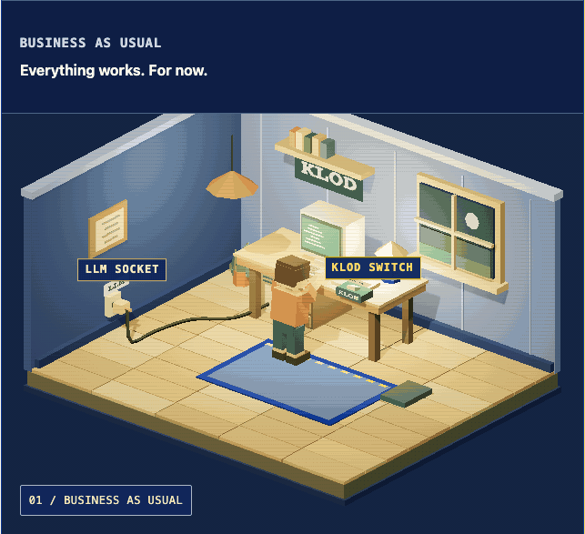

<p align="center">
  <a href="https://keepthelightson.eu"></a>
</p>

<h1 align="center">Keep The Lights On</h1>

<p align="center"><strong>AI can stop. Your business shouldn’t.</strong></p>

<p align="center">
  KLOD is a development pattern for software that depends on AI.<br>
  Build the tools, data access and human controls people need to keep essential work running.
</p>

<p align="center">
  <a href="https://keepthelightson.eu/learn.html">Learn the pattern</a> ·
  <a href="https://keepthelightson.eu/assess.html">Run the self-check</a> ·
  <a href="spec/SPECIFICATION.md">Read the specification</a> ·
  <a href="https://keepthelightson.eu/blog/">Read the blog</a>
</p>

<p align="center">
  <a href="https://keepthelightson.eu"></a>
</p>

<p align="center"><sub>See the interactive version at <a href="https://keepthelightson.eu">keepthelightson.eu</a>.</sub></p>

<!-- generated:release-line -->
**Specification 0.1.0** and **skills package 0.1.1**. Release tag: `v0.1.1`.
<!-- /generated:release-line -->

## Use KLOD with your workflow

Bring human takeover requirements into the tools you already use:

| Your workflow | KLOD integration |
|---|---|
| [Spec Kit](integrations/spec-kit/README.md) | An extension with feature planning and implementation review commands. |
| [OpenSpec](integrations/openspec/README.md) | A custom schema for proposals, specifications, design and tasks, with a verification handover. |
| [Your coding assistant](#the-two-skills) | Install the two portable skills with APM. |

The integrations bundle the same KLOD guidance. They are maintained by this project;
community catalog listing and upstream endorsement are separate from compatibility.

## The six principles

Design AI-powered software so people can keep essential work going when a supplier stops
serving you, or when the model itself has to be switched off.

**1. Know what stops when AI stops.**
List the work that depends on your AI supplier, such as answering customers or processing
invoices. Name who is responsible and decide what must keep running.

**2. Keep your data usable without AI.**
Save the requests, results and business rules people need in a form they can read without
your supplier. Show what is finished and what still needs doing.

**3. Build human takeover into the software.**
Provide the screens, tools and permissions people need to finish the job without AI.
Name and train the people responsible, and write instructions someone else can follow.

**4. Protect the backup from the same failure.**
Check what could stop AI and human work together: a shared login, cloud service or access
restriction. The backup needs to work through the failure you are preparing for.

**5. Prove it works with AI switched off.**
Regularly have people complete real work with AI unavailable. Measure time to the first
correct result, how much work they can handle, and for how long. Fix what fails and repeat.

**6. Keep an off switch, and the authority to use it.**
Give authorised people an independent way to stop AI from acting when its supplier fails or
its behaviour becomes unsafe. Keep the controls and information people need to take over.
For devices, machines and infrastructure, define a safe state when human operation is not
possible, and preserve safety interlocks. Practise the switch and the handover under an agreed
exercise plan.

## The two skills

| Skill | Use it to | Output |
|---|---|---|
| [klod](skills/klod/SKILL.md) | Build an AI feature with a manual path and off switch | Implementation, verification results and a `LIGHTS.md` entry |
| [klod-check](skills/klod-check/SKILL.md) | Review an existing repository | `klod_report.md` with dependencies, evidence, gaps and next actions |

Install with [APM](https://github.com/microsoft/apm) from your project directory:

<!-- generated:install-command -->
```sh
apm install AlexandruGirlea/keepthelightson#v0.1.1
```
<!-- /generated:install-command -->

Run `/klod-check` in Claude Code or `$klod-check` in Codex. To build a feature, invoke `klod`
with the feature request. See [installation and usage](https://keepthelightson.eu/skills.html) for other assistants.

## Use the report

1. Check the findings against your code and records, and add any missing evidence.
2. Give each issue an owner and a target date.
3. Build or improve the tools and instructions people need to take over.
4. Run a drill on real work with AI unavailable. Measure the time to the first correct
   result, how much work people can handle and how long they can keep it up.
5. Update `LIGHTS.md` and check again.

Reports record the project, repository URL, model used for the check and assessment time.
See the [report format](skills/klod-check/references/report-format.md).

## The levels

Levels apply to individual capabilities that depend on a hosted AI supplier. The
[human-control principle](skills/klod/references/human-control.md) also covers self-run AI.

| Level | Name | Condition |
|---|---|---|
| **L0** | Dark | No established manual path. |
| **L1** | Torchlight | A documented manual path; current drill evidence is not established. |
| **L2** | Generator | A manual path drilled at least every 90 days, with measured Time to Manual and capacity. |
| **L3** | Mains | Routine independent human work, a current review and supporting drill evidence. |

**Time to Manual** measures the time to the first correct human result. **Manual capacity**
records the share of normal work people sustain and for how long. Both come from drills.
L2 declarations expire after 120 days without a successful drill; L3 expires after twelve
months without a confirming review.

The [evidence gates](skills/klod-check/references/gates.md) define all requirements.

## What's in this repository

- `spec/SPECIFICATION.md`: the specification and its six principles.
- `skills/klod/`: implementation guidance and the references it needs.
- `skills/klod-check/`: repository review guidance and the references it needs.
- `integrations/`: the Spec Kit extension and OpenSpec custom schema, with setup guides.
- `rfcs/`: proposals and the process for changing requirements.

Each skill includes its references, licence and report metadata helper, so it can be used
without the website. Read [keepthelightson.eu](https://keepthelightson.eu) for guides,
the browser self-check and the blog.

## Check a change

Use Python 3.10+ from the repository root. No third-party packages are needed:

```sh
python3 .github/scripts/check_package.py --sync
python3 .github/scripts/check_package.py
```

The first command updates bundled references and release labels from their canonical sources.
The second checks that the copies match, local links work and each skill is self-contained.
Commit the source changes and updated copies together. See the
[contributor guide](CONTRIBUTING.md#check-a-change) for the files to edit.

The release workflow attaches both integration archives to each GitHub release. Build them
locally with:

```sh
python3 .github/scripts/build_integrations.py --output .cache/integrations
```

## Contributing

Send fixes through a pull request. Requirement changes follow the [RFC process](rfcs/README.md).
See [CONTRIBUTING.md](CONTRIBUTING.md) and [GOVERNANCE.md](GOVERNANCE.md).

## Author and licences

Created and maintained by Alex Girlea ([girlea.ro](https://girlea.ro)).

Specification and documentation: [CC BY 4.0](LICENSE-SPEC.md).
Original code: [MIT](LICENSE-CODE.md).
